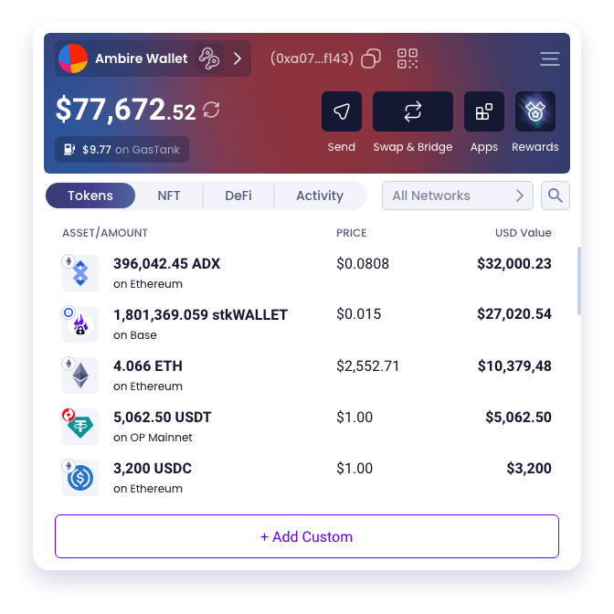

# Ambire Wallet

<div align="center">
  <a href="https://chromewebstore.google.com/detail/ambire-wallet/ehgjhhccekdedpbkifaojjaefeohnoea" target="_blank">
    <picture>
      <source media="(prefers-color-scheme: dark)" srcset="./mockups/mockup-dashboard-dark.png">
      <source media="(prefers-color-scheme: light)" srcset="./mockups/mockup-dashboard-light.png">
      
    </picture>
  </a>

  <p>
    Your Web3 wallet that just works. EIP-7702 ready.<br>
    <em>A self-custodial browser wallet extension built for Ethereum and EVM networks.</em><br />
    <a href="https://www.ambire.com/get-extension" target="_blank">
      <strong>Download Ambire extension 🔥</strong>
    </a>
    <br />
    <em>(Chrome, Firefox, Brave, Opera, Edge, Arc)</em>
    <br /><br />
    👥 Join the community:
    <a href="https://discord.com/invite/Ambire" target="_blank">Discord</a> |
    <a href="https://t.me/AmbireOfficial" target="_blank">Telegram</a>
    <br />
    🐞
    <a href="https://github.com/AmbireTech/extension/issues">Report a Bug</a> ·
    <a href="https://help.ambire.com/hc/en-us/requests/new" target="_blank">Get help</a>
  </p>
</div>

## Environment Setup

Built in a hybrid approach (with React Native and React Native Web) so that in a single codebase we can support building cross-browser extensions, mobile apps and web apps.

This project is built with Expo's bare workflow, allowing us to extend the default Vanilla React Native with additional expo modules in the form of installable expo libraries.

More about the environment setup and prerequisites [here](https://reactnative.dev/docs/environment-setup).

## Install

Install all dependencies:

```bash
yarn install
```

Install the [ambire-common](https://github.com/AmbireTech/ambire-common) submodule, a common ground for the Ambire apps, run:

```bash
git submodule init
git submodule update
```

## Environment Variables

Create ".env" file in the root directory and fill in all variables, see ".env-sample" for a reference.

## Editor Config

Make sure your code editor has plugins that support the following configuration files: `.editorconfig`, `.prettierrc`, `tsconfig.json`, `eslintrc.js`, [`import-sorter.json`](https://github.com/SoominHan/import-sorter).

## Browser Extensions

### Development-optimized Builds

- Start the browser extension for webkit browsers (tested mostly on Chrome and Brave):

  ```bash
  yarn web:webkit
  ```

  Then follow the instructions to load an unpacked extension [here](https://developer.chrome.com/docs/extensions/get-started/tutorial/hello-world#load-unpacked).

- Start the browser extension for gecko browsers (tested mostly on Firefox):

  ```bash
  yarn web:gecko
  ```

  Then follow the instructions to temporarily install an extension in Firefox [here](https://extensionworkshop.com/documentation/develop/temporary-installation-in-firefox/).

- Start the browser extension for the Safari browser:

  ```bash
  yarn web:safari
  ```

  Two new folders will be created:

  - build/safari-dev (dev build folder)
  - safari-extension/wallet-dev (Xcode project)

  then in the Safari browser:

  - Developer -> Developer settings...
  - Check the “Allow unsigned extensions” option. (Note: This setting may not persist after Safari is restarted.)​
  - Then the extension should be automatically added and pinned in the browser.

  NOTE: You can manage the available extensions from: Safari -> Settings... -> Extensions

  NOTE: The development script for Safari relies on the fswatch tool to automatically reload the Safari build when the development server is reloaded. If fswatch is not already installed on your system, you can install it using Homebrew with the following command:

  ```bash
  brew install fswatch
  ```

### Production-optimized Builds

- For webkit browsers:

  ```bash
  yarn build:web:webkit
  ```

  And find the resulting build in the "build/webkit-prod" folder.

- For gecko browsers:

  ```bash
  yarn build:web:gecko
  ```

  And find the resulting build in the "build/gecko-prod" folder.

- For the Safari browser:

  ```bash
  yarn build:web:safari
  ```

  Two new folders will be created:

  - "build/safari-prod" (production build folder)
  - "safari-extension/wallet" (the Xcode project)

  Then, in xCode manually do (TODO: automate these steps, it turned out to be a huge challenge):

  - Delete "walletTests" and "walletUITests" targets.
  - For both targets (macOS and extension): Signing & Capabilities: Team: "Ambire Tech Ltd", Signing Certificate: Development
  - For both targets (macOS and extension): General - Identity - Version: X.X (should match the version in the app.json file, example: `4.36`) and Build: X (integer, bump up on every next build submitted to the App Store Connect, example: `3`)
  - For the macOS target: General - App Category: "Utilities"
  - For the extension target: General - Identity - Bundle Identifier: `com.ambire.app.wallet.extension`

### Extract Source Maps

The production-optimized builds come with source maps files included. When preparing a production build for a browser store release, run the following commands to extract the source maps in separate directories:

- For the webkit build:

  ```bash
  yarn export:web:webkit:sourcemaps
  ```

  As a result, build/webkit-prod will no longer include the source map files (as before). Instead, a new folder, build/webkit-prod-source-maps, will be created to hold only the source maps. This folder should also be included in the GitHub release tag we create.

- For the gecko build:

  ```bash
  yarn export:web:gecko:sourcemaps
  ```

  Same as for the webkit build, but for the gecko build.

- For the Safari build: not implemented yet.

For more details, including how to trace /deminify a production reported error, see [#3191](https://github.com/AmbireTech/ambire-app/pull/3191).

### Store-prepared Builds

Automates the steps before every extension extension store release that could be otherwise done manually:

- Makes webkit and gecko extension production builds
- Exports source maps to "clean" the builds (and to prepare for upload those source maps in the GitHub release)
- Zips the "clean" builds (stores accept zips only) and the source maps

```bash
yarn build:extensions
```

And find the resulting zips in the "build" folder as `ambire-extension-<VERSION>-<TYPE>.zip`

## Mobile Apps

The Ambire v2 compatible mobile apps are yet to be developed. Coming sometime in the near future 🤞

## Explorer (Old name: Benzin)

Ambire's transaction explorer, that makes human readable ERC-4337 transactions and contract interactions.

Comes not only as integrated module in the Ambire extension(s), but as a standalone web app also.

### Development-optimized Build

```bash
yarn web:benzin
```

And find the resulting build in the "build/benzin-dev" folder.

### Production-optimized Build

```bash
yarn build:web:benzin
```

And find the resulting build in the "build/benzin-prod" folder.

## Ambire Rewards

Ambire Rewards is a gamified testing web3 app for the Ambire browser extensions. It is designed to users you discover the power of Smart Accounts via an epic onchain adventure. [Read more](https://rewards.ambire.com/).

### Development-optimized Build

```bash
yarn web:legends
```

And find the resulting build in the "build/legends-dev" folder.

```bash
yarn build:web:legends
```

And find the resulting build in the "build/legends-prod" folder.

## Others

### Browser Extensions E2E Tests

#### Configuration

We've migrated from Puppeteer to Playwright (./e2e-playwright-tests/). Documentation will follow soon.
